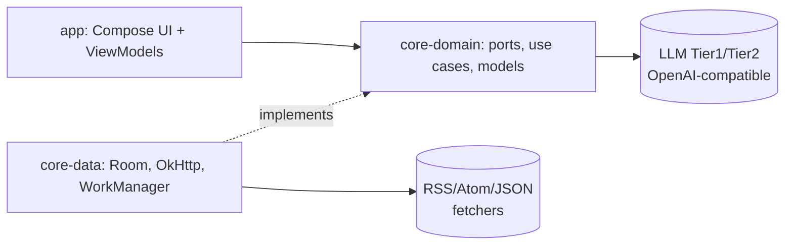

# Repository Guidelines

## Project Overview

Sapphire is a local-first, anonymous, AI-curated Android RSS reader. A user types a topic, a two-tier LLM builds the taxonomy and sources feeds, and the app curates an on-device timeline. No accounts; the only secret is an OpenAI-compatible LLM API key. Built with Jetpack Compose + Hilt + Room + Coroutines/Flow.

Authoritative context docs (read these for product/architecture depth):
- `docs/prd.md` — feature specs (§3.1 onboarding, §3.2 dual-view dashboard, §3.3 scroll-to-mark-read, §3.4 reader/save-later, §3.5 dynamic AI ops, §3.6/§3.7 agents)
- `docs/architecture.md` — locked decisions, entity model, LLM orchestration, mermaid diagrams
- `docs/roadmap.md` — vertical slices **S01–S07** with Definition of Done and a PRD §x.x coverage table. Phase work is referenced as "Slice S0x".

## Architecture & Data Flow

Layered clean architecture across three Gradle modules. Dependency direction: **app (UI) → core-domain (ports) ← core-data (implementations)**. `core-domain` is pure Kotlin (only `javax.inject` + kotlinx.serialization); it never sees Room, Android, or `BuildConfig`.



**Primary flow (onboarding → review → feed → reader):**
1. `OnboardingViewModel.generateFeed(phrase)` → `CurateTaxonomyUseCase` (Tier-1 LLM) → `LlmOutcome<ReviewModel>` staged in `OnboardingUiState.Review`.
2. User edits the model via `ReviewEdit`/`ReviewEditApplier`; `approve()` → `OnboardingRepository.commitReview` → `OnboardingDao.commitOnboarding` (`@Transaction`, atomic, `IGNORE` for idempotent sources).
3. `FeedViewModel.visibleTimeline` = `combine(_filter.flatMapLatest{...}, _query, _scope).stateIn(...)`. Refresh is `FeedRefreshService.refreshStreaming()` — a `channelFlow` fanning out one IO coroutine per source; the timeline is a live Room Flow.
4. `ReaderViewModel.open(itemId)` loads + classifies (Tier-1); `summarize`/`translate` are Tier-2 on tap. All ops cache-first via `LlmCacheEntity` keyed by `SHA-256(itemId, op, modelVersion)`.

**Non-obvious must-knows:**
- **Feed is the start destination**, not onboarding. `SeedDefaultFeedsCallback` seeds baseline Technology/World feeds so the timeline is usable immediately; onboarding is reached via the toolbar "+".
- `SeedDefaultFeedsCallback` seeds from **both `onCreate` and `onOpen`** (empty-guarded) to survive Android Auto Backup restores where `onCreate` never fires.
- **Read state is explicit-only**: scroll never marks read. Only reader-open (`markReadOnOpen`) and manual toggles; undo is a first-class `Channel` event.
- **Saved items are exempt from the 30-day retention purge** (`RetentionWorker`); purge gates on `saved_later = 0`.
- `RoomSourceRepository` synthesizes **virtual `domain:` L2 sub-folders** at view-time when ≥2 sources share a host — presentation-only, not persisted.
- `OpenAiCompatibleLlmClient` sends GLM-specific `thinking:{type:"disabled"}` to suppress reasoning latency (harmlessly ignored by stock OpenAI).
- XML parsing uses Android's bundled `XmlPullParser` (kxml2), deliberately avoiding Rome.

## Key Directories

```
app/src/main/kotlin/com/sapphire/app/
  SapphireApp.kt            # @HiltAndroidApp; WorkManager config; crash handler; retention schedule
  MainActivity.kt           # minimal shell: edge-to-edge + SapphireNavHost
  di/AppConfigModule.kt     # ONLY BuildConfig touchpoint (bridges local.properties → LlmConfig)
  ui/                       # @HiltViewModel screens + SapphireNavHost + theme/ + design/
core-domain/src/main/kotlin/com/sapphire/domain/
  llm/LlmClient.kt          # LlmOutcome<T> = Ok|Err(LlmError) — canonical Result taxonomy
  onboarding/ review/ feed/ source/ reader/ save/ explore/  # ports + use cases per feature
  model/Enums.kt            # SourceKind, HealthState, ReadState, ReadMechanism
  util/IdGenerator.kt       # fun interface; injectable for deterministic test ids
core-data/src/main/kotlin/com/sapphire/data/
  db/                       # SapphireDatabase (@Database v8), Entities.kt, 6 DAOs
  feed/                     # FeedRefreshService, FetcherRegistry, RssAtom/JsonFeed fetchers
  onboarding/RoomOnboardingRepository.kt + ReviewMapper.kt
  source/RoomSourceRepository.kt + OpmlParser/Serializer
  reader/ save/ explore/ llm/OpenAiCompatibleLlmClient.kt
  work/RetentionWorker.kt   # @HiltWorker; 24h periodic purge
  di/DataModule.kt          # Hilt hub: DB + DAOs + OkHttp + repositories + use cases
```

## Development Commands

Gradle 9.6.0 via wrapper. On Windows use `gradlew.bat` or `_gw.bat` (a `JAVA_HOME`/SDK shim).

```bash
./gradlew assembleDebug            # build debug APK
./gradlew installDebug             # build + install on connected device
./gradlew lintDebug                # Android lint

./gradlew test                     # all unit tests
./gradlew :core-domain:test        # pure-JVM domain tests
./gradlew :core-data:test          # Robolectric Room/repo/feed tests
./gradlew :core-data:testDebugUnitTest --tests "com.sapphire.data.db.SourceDaoTest"  # one class

./gradlew :app:compileDebugKotlin :core-data:compileDebugKotlin :core-domain:compileKotlin  # fast typecheck
```

> Note: `core-domain` is a JVM module (no `compileDebugKotlin`); use `:core-domain:compileKotlin`. The `app` module has **no unit tests** — all tests live in `core-data` (Robolectric) and `core-domain` (pure JVM).

**ADB** (not on PATH; full path required on this machine):
```
C:\Users\Shaun\AppData\Local\Android\Sdk\platform-tools\adb.exe
```

## Code Conventions & Common Patterns

**State & coroutines.** Every ViewModel uses `MutableStateFlow` + `asStateFlow()` (private `_state` / public `state` split) and `viewModelScope.launch {}` for fire-and-forget. Cold→hot is always `flow.stateIn(viewModelScope, SharingStarted.WhileSubscribed(5000), default)`. Combined flows use `combine()`; switching pipelines use `_filter.flatMapLatest { when(...) }` (gated by `@OptIn(ExperimentalCoroutinesApi::class)`).

**Threading.** `withContext(Dispatchers.IO)` wraps every suspend repo/DAO write and the LLM client. Room read Flows are cold and self-dispatched. Concurrent fan-out uses `channelFlow { ... launch(Dispatchers.IO){ send(...) } ... jobs.joinAll() }` (see `FeedRefreshService.refreshStreaming`).

**Result types (no exceptions cross boundaries).**
- `LlmOutcome<out T>` = `Ok(value)` | `Err(LlmError)` — canonical for all LLM calls (`core-domain/llm/LlmClient.kt`).
- `LlmError` sealed: `Empty`, `Timeout`, `RateLimited`, `InvalidResponse`, `NotConfigured`, `Http(status)`, `Network(message)`; each exposes `userMessage()`.
- `SourceRepository.Outcome` sealed: `Ok` | `Conflict(existingCategoryId)` — write-collision result surfaced from `INSERT OR IGNORE` rowId `-1`.
- Per-screen `UiState` sealed interfaces (`OnboardingUiState`, `ReaderUiState`, `ClassificationState`, `SummaryState`, `TranslateState`, etc.).

**Dependency injection (Hilt).** All modules `@InstallIn(SingletonComponent::class)`. `core-data/di/DataModule.kt` is the hub: provides `SapphireDatabase` + 6 DAOs, `OkHttpClient`, `IdGenerator`, use cases, and `@Binds` 10 repository ports to their `Room*` impls. The `BuildConfig` inversion seam: `LlmConfigProvider` interface is declared in core-data but implemented in `app/di/AppConfigModule.kt` (`BuildConfigLlmConfigProvider`) so core-data stays BuildConfig-free. `@HiltWorker RetentionWorker` uses `@AssistedInject`; the app disables WorkManager's default initializer and provides `Configuration.Provider`.

**Room.** Schema version **8**, `exportSchema = false`, **destructive migration** (`fallbackToDestructiveMigration`) — schema churn wipes user data; no migration code exists, so bump `version` when entities change. Entities in `core-data/db/Entities.kt`; snake_case columns via `@ColumnInfo`, camelCase fields. Dedup is `INSERT OR IGNORE`: PK `hash_uuid` (SHA-256 of feed item URL/title+date) for ingest, unique `(category_id, url)` for sources. Multi-step writes are `@Transaction` default methods. Entity→domain mapping happens at the repository boundary via `internal fun XEntity.toDomain()` extensions; domain code never sees Room types.

**Naming.** Domain ports: `XRepository`, `XUseCase`, `Fetcher`, `XStore`, `XCache` (interfaces); impls prefixed `Room`/`OpenAi`. Entities suffixed `Entity`. ViewModels suffixed `ViewModel`, screens suffixed `Screen`. Route constants in a top-level `object Routes`.

## Important Files

| File | Purpose |
| --- | --- |
| `app/src/main/kotlin/com/sapphire/app/SapphireApp.kt` | `@HiltAndroidApp` Application; installs Hilt `WorkerFactory`, global crash handler (tag `SapphireCrash`), schedules retention. |
| `app/src/main/kotlin/com/sapphire/app/ui/SapphireNavHost.kt` | Single `NavHost`; `object Routes` (ONBOARDING/REVIEW/FEED/SAVED/EXPLORE); **startDestination = FEED**. |
| `app/src/main/kotlin/com/sapphire/app/di/AppConfigModule.kt` | The ONLY `BuildConfig` touchpoint; bridges `local.properties` → `LlmConfig`. |
| `core-domain/src/main/kotlin/com/sapphire/domain/llm/LlmClient.kt` | `LlmOutcome`/`LlmError` taxonomy — read before touching any LLM path. |
| `core-data/src/main/kotlin/com/sapphire/data/db/SapphireDatabase.kt` | `@Database` v8, 9 entities, destructive migration. Bump version on entity change. |
| `core-data/src/main/kotlin/com/sapphire/data/db/Entities.kt` | All `@Entity` classes; the data model source of truth. |
| `core-data/src/main/kotlin/com/sapphire/data/db/SeedDefaultFeedsCallback.kt` | Baseline feed seeding (onCreate + onOpen). |
| `core-data/src/main/kotlin/com/sapphire/data/feed/FeedRefreshService.kt` | Ingest pipeline; `refreshStreaming()` channelFlow fan-out. |
| `core-data/src/main/kotlin/com/sapphire/data/di/DataModule.kt` | Hilt hub — DB, DAOs, repos, use cases, OkHttp. |
| `core-data/src/main/assets/explore-catalog.json` | Bundled curated catalog rails for Explore. |

## Runtime / Tooling Preferences

- **JDK 21** required (Android Studio JBR via `gradle/gradle-daemon-jvm.properties`; foojay auto-provisioning enabled).
- **Android SDK 34** + build-tools 34.0.0; `minSdk = 29`, `compileSdk = targetSdk = 34`.
- Java/Kotlin target **JVM_21**.
- AGP **9.2.1**, Kotlin **2.2.10**, KSP **2.3.2**, Hilt **2.59.2**, Room **2.7.2**, Compose BOM **2024.09.02**. Versions centralized in `gradle/libs.versions.toml`.
- Repositories: Aliyun mirrors declared **before** `google()`/`mavenCentral()` in `settings.gradle.kts` (`repositoriesMode = FAIL_ON_PROJECT_REPOS`).

## Secrets

`local.properties` is gitignored and holds `SAPPHIRE_LLM_API_KEY`, `SAPPHIRE_LLM_BASE_URL`, `SAPPHIRE_LLM_TIER1_MODEL`, `SAPPHIRE_LLM_TIER2_MODEL`, plus `sdk.dir`. These feed `BuildConfig` at build time.

- **Treat the API key as a secret.** Never echo, log, commit, or paste it. Defaults if absent: `baseUrl = https://api.openai.com/v1/`, `tier1 = gpt-4o-mini`, `tier2 = gpt-4o`, `apiKey = ""`.
- Debug builds get `.debug` applicationId suffix (`com.sapphire.app.debug`); the key is compiled in, so **do not distribute debug builds**.

## Testing & QA

- **Stack:** JUnit4 + `kotlinx-coroutines-test` (`runTest`) + **Robolectric** for anything touching Room/Android. No MockK, no Turbine, no Espresso/UI tests.
- **No `app`-module tests.** All tests live in `core-data` (Robolectric + in-memory Room) and `core-domain` (pure JVM).
- **In-memory Room** via `Room.inMemoryDatabaseBuilder(ctx, SapphireDatabase::class.java).allowMainThreadQueries().build()`; close in `@After`.
- **Hand-rolled fakes** per test class — `StubLlm`, `StaticFetcher`, `SequentialIds`, `RecordingLlm`, `FetcherRegistry.forTesting(mapOf(...))`. No mocking frameworks.
- **Test naming:** backtick descriptive names (`fun `updateSource changes title url and kind`()`). A few legacy snake_case names exist in `SeedDefaultFeedsCallbackTest` and `FeedParsingDateTest`.
- Coverage spans DAOs (SourceDao, FeedDao, OnboardingDao, SavedItemDao, etc.), repositories, the ingest pipeline (with a real `RssAtomFetcher` parsing captured XML in one case), use cases, and pure parsers/mappers. **ViewModel tests do not exist.**
- Run a single class: `./gradlew :core-data:testDebugUnitTest --tests "fully.qualified.ClassName"`.
